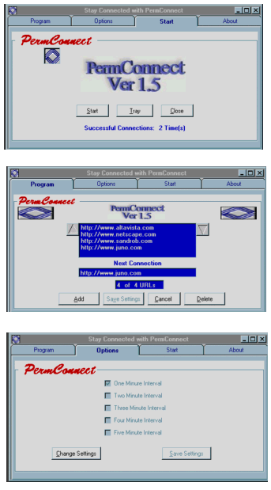



## permConnect

### Description

Have you ever been on the Internet and had to

walk away for a few minutes, which turned into a

few minutes more? Only to return and find your

connection is lost

Stay Connected with PermConnect.

Code Examples: Database, WebBrowser, ssTab, ini,

For Next Loop and much more... Commented.
 
### More Info
 

             |
---                |---
**Submitted On**   |2001-02-26 16:01:00
**By**             |[Tom Roberts](https://github.com/Planet-Source-Code/PSCIndex/blob/master/ByAuthor/tom-roberts.md)
**Level**          |Intermediate
**User Rating**    |4.0 (12 globes from 3 users)
**Compatibility**  |VB 5\.0, VB 6\.0
**Category**       |[Internet/ HTML](https://github.com/Planet-Source-Code/PSCIndex/blob/master/ByCategory/internet-html__1-34.md)
**World**          |[Visual Basic](https://github.com/Planet-Source-Code/PSCIndex/blob/master/ByWorld/visual-basic.md)
**Archive File**   |[CODE\_UPLOAD155792272001\.zip](https://github.com/Planet-Source-Code/tom-roberts-permconnect__1-21353/archive/master.zip)

